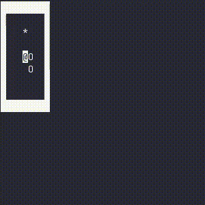

# My F# Snake
[Web version demo](https://alex11br.github.io/myfsharpsnake-web)

Yet another snake game witten in F#. This one has 2 versions: one that runs in the terminal, and a webapp.

If your snake grows big enough (half of the available board space), the board will grow by one block in width and length. The starting board is of size 7x7 and the snake has a length of 3. Can you reach the point in which the board starts growing?

You can move the snake using the arrow keys (up points the snake upwards, down points the snake downwards, etc). If you want to leave, a `^C` would do it.

If you hit walls or yourself, you die.

## How I got the inspiration
I got a little bit interested in functional programming, and this is my first project in one of the more "pure" functional programming languages. I plan on other bigger stuff, but I decided to try this little snake game with a growing board idea first.

I would like to shout out [markvincze's F# snake implementation](https://github.com/markvincze/FableSnake) that provided me an easy to browse example of a functional, immutable approach to this problem.
